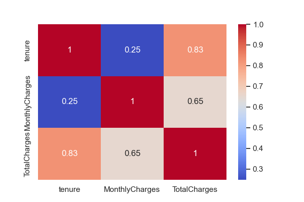
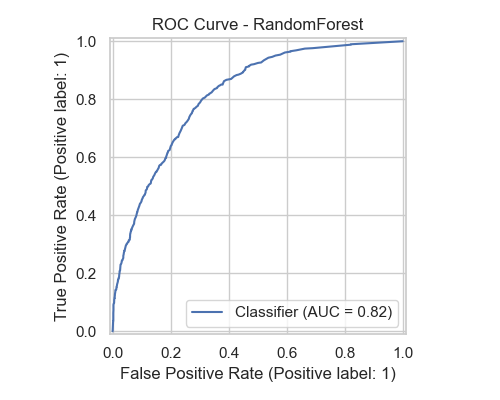
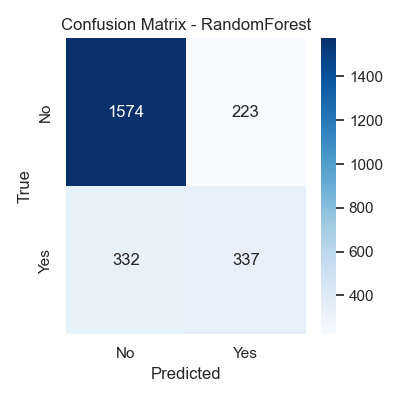

# Churn-Prediction-ML


## 🧠 Problem Statement

Telecom companies lose a significant percentage of customers due to churn.
The goal of this project is to **predict which customers are likely to churn** so the business can take preventive action and improve customer retention.


## 📁 Project Structure

```
churn-prediction-ML/
│
├── DATA/
│   └── churn_data.csv
│
├── images/
│   ├── tenure_hist.png
│   ├── MonthlyCharges_hist.png
│   ├── TotalCharges_hist.png
│   ├── churn_distribution.png
│   ├── corr_numeric.png
│   ├── box_tenure_vs_churn.png
│   ├── box_MonthlyCharges_vs_churn.png
│   ├── box_TotalCharges_vs_churn.png
│   ├── roc_RandomForest.png
│   ├── confusion_RandomForest.png
│   └── (other generated plots)
│
├── notebook/
│   ├── churn_EDA.ipynb
│   └── churn_modeling.ipynb
│
├── models/
│   └── churn_RandomForest.pkl
│
└── README.md
```


##  Dataset Overview

* **Rows:** 7,043
* **Target:** `Churn` (Yes / No)
* **Features:** Customer demographics, services used, billing information, tenure behavior

### Key Columns:

* `tenure`
* `MonthlyCharges`
* `TotalCharges`
* `Contract`
* `PaymentMethod`
* `PhoneService`
* `PaperlessBilling`


##  Phase-1: Exploratory Data Analysis (EDA)

###  Performed Tasks

* Dataset shape, missing values, dtype verification
* Fixed `TotalCharges` (originally stored as string → converted to float)
* Numeric summary statistics (mean, median, std, skewness)
* Numeric distribution plots
* Boxplots vs `Churn`
* Crosstab & percentage churn-rate for categorical features
* Correlation heatmap of numeric features
* Churn distribution analysis

###  Major Insights

* **Low-tenure customers churn significantly more**
* **Month-to-month contracts have the highest churn rate (~42%)**
* **Electronic check users show the highest churn (~45%)**
* **Customers with higher `MonthlyCharges` tend to churn more**
* **`TotalCharges` is strongly related to tenure and churn behaviours**

## 🛠 Phase-2 & Phase-3: Preprocessing + Modeling

### ✔ Preprocessing Steps

* Train-test split (65/35 stratified)
* Numeric Pipeline

  * Median Imputation
  * Standard Scaling
* Categorical Pipeline

  * Most Frequent Imputation
  * OneHot Encoding
* Combined using ColumnTransformer
* Pipeline ensures no data leakage

### ✔ Models Built

* Logistic Regression
* Decision Tree Classifier
* Random Forest Classifier


##  Model Performance Summary

| Model               | Accuracy | Recall (Churn=Yes) | AUC      | Notes               |
| ------------------- | -------- | ------------------ | -------- | ------------------- |
| Logistic Regression | 0.80     | 0.70               | 0.84     | Fast baseline model |
| Decision Tree       | 0.79     | 0.66               | 0.78     | Slight overfitting  |
| **Random Forest**   | **0.83** | **0.73**           | **0.86** | ⭐ Best model        |

---

##  Visualizations

All generated plots are stored in the `/images/` folder.

### Churn Distribution


### Numeric Correlation Heatmap



### ROC Curve (Random Forest)



### Confusion Matrix (Random Forest)



---

## 🧪 How to Run This Project

### 1️⃣ Clone the Repository

```bash
git clone https://github.com/yourusername/churn-prediction-ML.git
cd churn-prediction-ML
```

### 2️⃣ Install Dependencies

```bash
pip install -r requirements.txt
```

### 3️⃣ Run Jupyter Notebook

```bash
jupyter notebook
```

### 4️⃣ Open and Run

* `notebook/churn_EDA.ipynb`
* `notebook/churn_modeling.ipynb`

---
##  requirements.txt

```
pandas
numpy
matplotlib
seaborn
scikit-learn
joblib
```


 Future Enhancements

* GridSearchCV / RandomizedSearchCV hyperparameter tuning
* XGBoost, LightGBM, CatBoost models
* SHAP explanations for model interpretability
* Deployment with Streamlit / FastAPI
* Customer segmentation via clustering


 Author

**Sai Aneesh Ganti**
📧 Email: [gantisaianeesh@gmail.com](mailto:gantisaianeesh@gmail.com)
🔗 LinkedIn: [https://www.linkedin.com/in/sai-aneesh-933a95230/](https://www.linkedin.com/in/sai-aneesh-933a95230/)
🔗 GitHub: [https://github.com/Saianeesh2003](https://github.com/Saianeesh2003)


